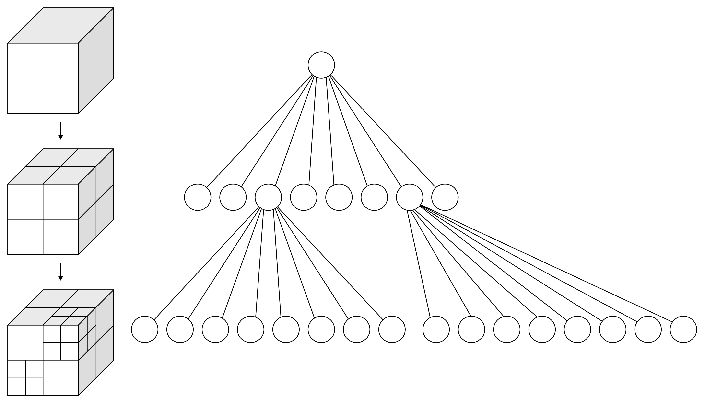
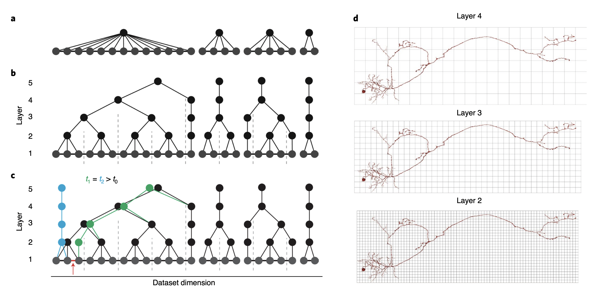

The chunkedgraph is a dynamic oct-tree connected components supervoxel
graph.

{width="600px"}

A visual representation of an oct-tree ([Wikipedia
(WhiteTimberwolf)](https://en.wikipedia.org/wiki/Octree) [CC BY-SA
3.0](http://creativecommons.org/licenses/by-sa/3.0/))

As with any oct-tree, it is organized in hierarchical levels, with the
bottom level 1 corresponding to the supervoxels of the segmentations,
and the top level being the unique connected components of the
supervoxel graph.

{width="700px"}

A figure illustrating the spatial chunking and editing of a the
chunkedgraph. From [Dorkenwald et. al
2021](https://doi.org/10.1038/s41592-021-01330-0)

The ChunkedGraph client allows one to interact with the ChunkedGraph
service, which stores and updates the supervoxel agglomeration graph.
This is most often useful for looking up an object root id of a
supervoxel or looking up supervoxels belonging to a root id. The
ChunkedGraph client is at `client.chunkedgraph`.

## Look up a supervoxel

Usually in Neuroglancer, one never notices supervoxel ids, but they are
important for programmatic work. In order to look up the root id for a
location in space, one needs to use the supervoxel segmentation to get
the associated supervoxel id. The ChunkedGraph client makes this easy
using the [client.chunkedgraph.get_root_id()]({{ api_paths.chunkedgraph }}.get_root_id)
method.

```python
sv_id = 104200755619042523
client.chunkedgraph.get_root_id(supervoxel_id=sv_id)
```

However, as proofreading occurs, the root id that a supervoxel belongs
to can change. By default, this function returns the current state,
however one can also provide a UTC timestamp to get the root id at a
particular moment in history. This can be useful for reproducible
analysis. Note below that the root id for the same supervoxel is
different than it is now.

```python
import datetime

# I looked up the UTC POSIX timestamp from a day in early 2019.
timestamp = datetime.datetime.utcfromtimestamp(1546595253)

sv_id = 104200755619042523
client.chunkedgraph.get_root_id(supervoxel_id=sv_id, timestamp=timestamp)
```

If you are doing this across lots of supervoxels (or any nodes) then you
can do it more efficiently in one request with
[client.chunkedgraph.get_roots()]({{ api_paths.chunkedgraph }}.get_roots)

```python
node_ids = [104200755619042523, 104200755619042524,104200755619042525]
root_ids = client.chunkedgraph.get_roots(node_ids)
```

## Getting supervoxels for a root id

A root id is associated with a particular agglomeration of supervoxels,
which can be found with the
[client.chunkedgraph.get_leaves()]({{ api_paths.chunkedgraph }}.get_leaves) method.
A new root id is generated for every new change in the chunkedgraph, so time stamps do not apply.

```python
root_id = 648518346349541252
client.chunkedgraph.get_leaves(root_id)
```

You can also query the chunkedgraph not all the way to the bottom, using
the stop_layer option

```python
root_id = 648518346349541252
client.chunkedgraph.get_leaves(root_id,stop_layer=2)
```

This will get all the level 2 IDs for this root, which correspond to the
lowest chunk of the hierarchy. An analogous option exists for
[client.chunkedgraph.get_roots()]({{ api_paths.chunkedgraph }}.get_roots).
This is useful to help find nodes to query within the `l2cache`, amongst other things.

## Other functions

There are a variety of other interesting functions to explore in
[client.chunkedgraph]({{ api_paths.chunkedgraph }}).
